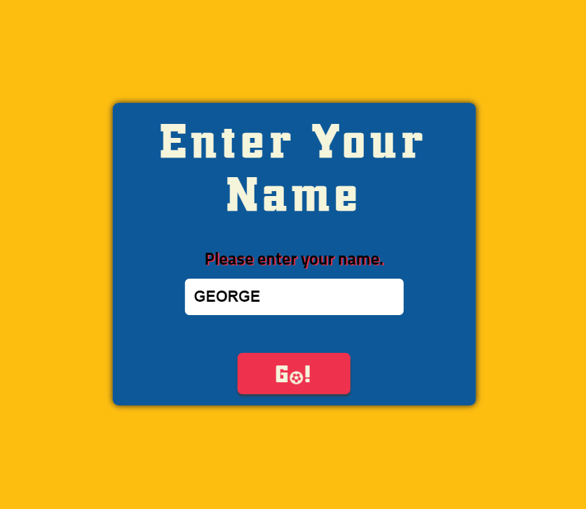

<h1 align="center">Football Quiz</h1>

[View the live project here](https://georgeh23.github.io/football-quiz/)

## Index – Table of Contents
* [Introduction](#introduction)
* [User Experience (UX)](#user-experience-ux) 
* [Features](#features)
* [Issues and Bugs](#issues-and-bugs)
* [Technologies Used](#technologies-used)
* [Testing](#testing)
* [Deployment](#deployment)
* [Credits](#credits)

## Introduction

The Football Quiz is a full challenge quiz with various questions about football including history, players, teams and memorable moments. Get ready and put your football knowledge to the test with our exciting quiz!

## User Experience (UX)

### User stories
Based on target audience:
* As a football fan, I want to test my knowledge about sport and challenge myself.
* As a football learner, I want to have an immediate feedback after answering each question.
* As a football fan, I want the quiz to include a variety of questions based on categories.
* As a competitive fan, I want to see the score at the end of the quiz.

### Design
-   #### The color palette used in the website:
    1. Primary/Accent Colors: #EE324E and #00529F;
    2. Background Color: #FEBE10;
    3. Text Color: beige/black;
    - [Color Palette inspiration](https://teamcolorcodes.com/real-madrid-c-f-colors/#:~:text=Color%20Codes%20HEX-,Real%20Madrid%20C.F.,%2C%20and%20%23EE324E%20for%20red.)

-   ### Typography

-   #### The typography used in the website:
    1. Primary Font: [Trump Town Pro](https://fonts.cdnfonts.com/css/trump-town-pro)
    2. Accent Font: [Titillium](https://fonts.cdnfonts.com/css/titillium)
    * Both imported from [Google Fonts](https://fonts.google.com/)

## Features

### Existing Features

-   __Home Page__
    - Press the start button to enjoy the quiz.
      

-   __Modal Section__
    - Enter your name first, after that you are good to Go!
    - The name is mandatory, an error will occur if you don't fill the input box.
      

-   __Categories section__
    - Each category contains several questions that will come randomly each time the test starts.
    - Choose a category and the questions will begin.
      

-   __Questions section__
    - If the answer is correct, the answer will be green.
    - If is wrong, the answer that was chosen will be red and the correct one will be pointed with green.
    - A message will be displayed to let you know the status of your answer.
    - Press the next button when you are redy to go to the next question.
      

-   __End Game section__
    - In the End section a message of encouragement and the final score is displayed.
    - Press Try Again button if you want to do the quiz again.
      

## Issues and Bugs
-   ### Solved
    - The question is not checked
        * I have called the checkAnswer function in display question function
    - The Quiz is not starting
        * I have create an Event Listener where I have called the start quiz function
    - Improve data consistency
        * use deep copy objects

## Technologies Used
### Main Languages Used
-   [JS](https://en.wikipedia.org/wiki/JavaScript)
-   [HTML5](https://en.wikipedia.org/wiki/HTML5)
-   [CSS3](https://en.wikipedia.org/wiki/Cascading_Style_Sheets)

### Frameworks, Libraries & Programs Used

-   [Google Fonts:](https://fonts.google.com/) was used to import the 'Titillium' and 'Trump Town Pro' fonts into the style.css file.
-   [Font Awesome:](https://fontawesome.com/) was used to add icons.
-   [GitHub:](https://github.com/) is used as the respository for the projects code after being pushed from Git.
-   [Coolors:](https://coolors.co/) was used to create the color palette.

## Testing

- [HTML Validator](https://validator.w3.org/)
    - result for index.html
        

- [CSS Validator](https://jigsaw.w3.org/css-validator/)

    - result for styles.css 
      

- [JS Validator](https://jshint.com/)

    - result for main.js 
      

## Deployment

- This project was developed using [GitPod](https://www.gitpod.io/) and [CodeAnyWhere](https://codeanywhere.com/).
- I have used the terminal to commit changes in my GitHub repository.
- In the GitHub I have created Issues, the commits are related to the Issues.

### Deploying on GitHub Pages
To deploy this page to GitHub Pages from its GitHub repository, the following steps were taken:

1. Log into [GitHub](https://github.com/login "Link to GitHub login page") or [create an account](https://github.com/join "Link to GitHub create account page").
2. Locate the [GitHub Repository](https://github.com/GeorgeH23/football-quiz "Link to GitHub Repo").
3. At the top of the repository, select Settings from the menu items.
4. Scroll down the Settings page to the "Pages" section.
5. Under "Source" click the drop-down menu labelled "None" and select "Main".
6. Upon selection, the page will automatically refresh meaning that the website is now deployed.
7. Scroll back down to the "Pages" section to retrieve the deployed link.

## Credits 

### Content 
- The ReadME file was inspired from my first project [Travel Addict](https://github.com/GeorgeH23/travel-addict/blob/main/README.md) and [Love Maths](https://github.com/Code-Institute-Solutions/readme-love-maths/blob/master/README.md)
- All other content was written by the developer

### Code
- [Modal Container](https://www.tutorialspoint.com/how-to-align-the-modal-content-box-to-the-center-of-any-screen?fbclid=IwAR0B5UzubrLahMMh2J2dPcV9jevHQ9C2cuEL2E28yHhAm4tnft9KEO8RM8E)
- [Center Modal](https://www.tutorialspoint.com/how-to-align-the-modal-content-box-to-the-center-of-any-screen?fbclid=IwAR0B5UzubrLahMMh2J2dPcV9jevHQ9C2cuEL2E28yHhAm4tnft9KEO8RM8E)
- [Animation](https://www.w3schools.com/w3css/tryit.asp?filename=tryw3css_modal4)
- [Data Consistency](https://www.c-sharpcorner.com/article/how-to-clone-complex-data-structures-in-javascript-the-deep-copy-and-structured/)

